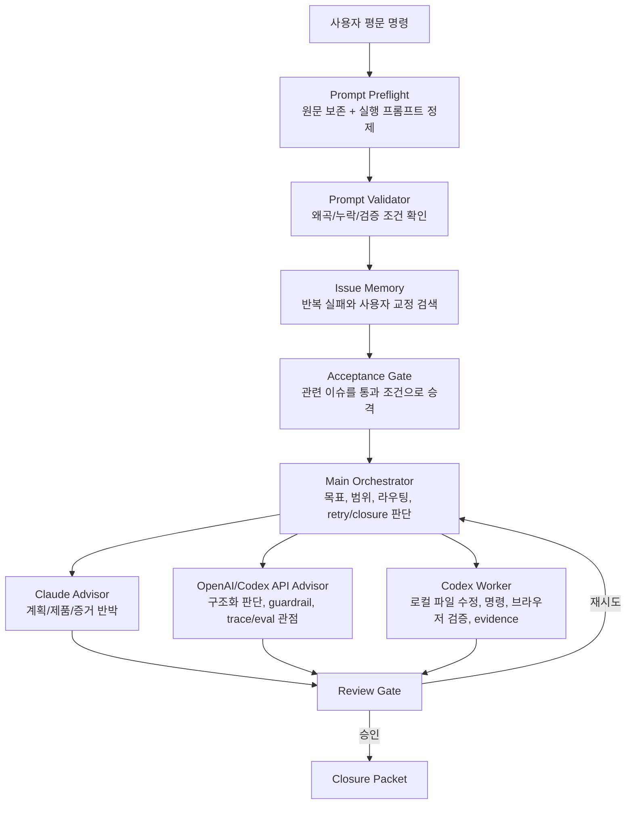

# SC Spire Agent Orchestrator

SC Spire 작업을 위해 만든 로컬 에이전트 오케스트레이터입니다. 사용자가 평문으로 명령을 넣으면 프롬프트 사전 검증, 이슈 메모리, 메인 오케스트레이터 판단, Codex 작업자, Claude 검토자, OpenAI Agents SDK/API 보좌 경로를 하나의 실행 기록으로 남깁니다.

이 repo의 목표는 단순 로그 뷰어가 아니라, 여러 모델과 도구가 같은 실수를 반복하지 않도록 작업 흐름, 검증, evidence, retry 판단을 눈으로 확인 가능한 형태로 만드는 것입니다.

## 핵심 구조



## 실행 경로

| 경로 | 기본 용도 | 비용/권한 관점 |
|---|---|---|
| Codex 구독/CLI/앱 | 로컬 repo 조사, 파일 수정, 테스트, 브라우저 검증, evidence 패키징 | API 예산을 쓰지 않는 주 작업자 |
| Claude MAX/CLI | 계획 비판, 제품/디자인 판단, closure 반박, 약한 가정 탐지 | 독립 검토자 |
| OpenAI Agents SDK 방식 | agent 정의, handoff, guardrail, state/result, trace/eval-ready 기록 | API 호출 없이도 구조와 계약을 적용 |
| OpenAI API / Agents SDK live call | 작은 구조화 판단, preflight, guardrail, trace/eval 보강 | 예산 제한이 있는 보조 경로 |
| Gemini future route | 제3 검토 레인 | 키가 준비되면 활성화 |

OpenAI 공식 문서 기준으로 Agents SDK는 agent 정의, handoff, guardrail, result/state, tracing/observability를 갖춘 agentic workflow용 도구입니다. ChatKit은 Agents SDK와 연결 가능한 채팅 UI 경로로 사용할 수 있습니다.

## 설치

```powershell
git clone https://github.com/Wish-Upon-A-Star/sc-spire-agent-orchestrator.git
cd sc-spire-agent-orchestrator
py -3.13 -m venv .venv
.venv\Scripts\python.exe -m pip install -r tools\sc_spire_agent_sdk_orchestrator\requirements.txt
```

`openai-agents`는 선택 의존성입니다. import가 실패해도 로컬 dashboard와 dry-run contract는 동작해야 합니다.

## 실행

```powershell
.venv\Scripts\python.exe tools\sc_spire_agent_sdk_orchestrator\viewer_server.py --host 127.0.0.1 --port 8766
```

브라우저:

```text
http://127.0.0.1:8766
```

Windows 바로 실행:

```powershell
tools\sc_spire_agent_sdk_orchestrator\start_agent_viewer.ps1
```

## 사용법

1. 오른쪽 `메시지 넣기`에 평문 명령을 입력합니다.
2. 기본 대상은 `프롬프트 사전 검증`입니다.
3. 서버는 원문을 보존하고, 메인 오케스트레이터용 정제 프롬프트를 만듭니다.
4. `상태` 탭의 `현재 명령` 카드에서 원문, 상태, 경로, 검증, 승격 이슈, 다음 액션을 확인합니다.
5. `작업자 대화` 탭에서 이번 run의 실제 transcript 이벤트만 확인합니다.
6. `마일스톤`, `이슈/공유정보`, `라우팅/규칙` 탭에서 게이트와 provider route를 확인합니다.

## 주요 명령

Dry run:

```powershell
.venv\Scripts\python.exe tools\sc_spire_agent_sdk_orchestrator\sc_spire_ovv_orchestrator.py --goal tools\sc_spire_agent_sdk_orchestrator\sample_goal.json --dry-run
```

SDK/라우팅 상태 확인:

```powershell
.venv\Scripts\python.exe tools\sc_spire_agent_sdk_orchestrator\sc_spire_ovv_orchestrator.py --goal tools\sc_spire_agent_sdk_orchestrator\sample_goal.json --run-sdk --json
```

뷰어 smoke test:

```powershell
.venv\Scripts\python.exe tools\sc_spire_agent_sdk_orchestrator\smoke_test_viewer.py
```

## 파일 구조

```text
tools/sc_spire_agent_sdk_orchestrator/
  viewer_server.py              # 로컬 API + HTML 서버
  viewer_static/                # 운영자 dashboard UI
  provider_routing.json         # Codex/Claude/OpenAI/Gemini 라우팅 정책
  agents_sdk_pattern.py         # API 호출 없이 Agents SDK 운영 방식 artifact 생성
  agents_sdk_live_adapter.py    # 선택적 live SDK adapter
  sc_spire_ovv_orchestrator.py  # dry-run / local dialogue orchestration CLI
  smoke_test_viewer.py          # dashboard API smoke test
docs/
  ORCHESTRATOR_IMPROVEMENT_PLAN.md
memory/issues_log/
  .gitkeep
output/agent_orchestrator_runs/
  .gitkeep
```

## 안전 규칙

- API 키를 commit하지 않습니다.
- `OPENAI_API_KEY` 또는 `%USERPROFILE%\Desktop\openai.txt`에서 키를 읽을 수 있지만 값은 출력하지 않습니다.
- `output/agent_orchestrator_runs/`의 실제 실행 기록은 기본적으로 git에 올리지 않습니다.
- Claude, Codex, OpenAI API는 서로 대체제가 아니라 각자 강점이 다른 route입니다.
- worker 결과만으로 completed 처리하지 않습니다. review gate와 evidence가 필요합니다.

## 개선 방향

자세한 제안은 [docs/ORCHESTRATOR_IMPROVEMENT_PLAN.md](docs/ORCHESTRATOR_IMPROVEMENT_PLAN.md)에 정리했습니다.
